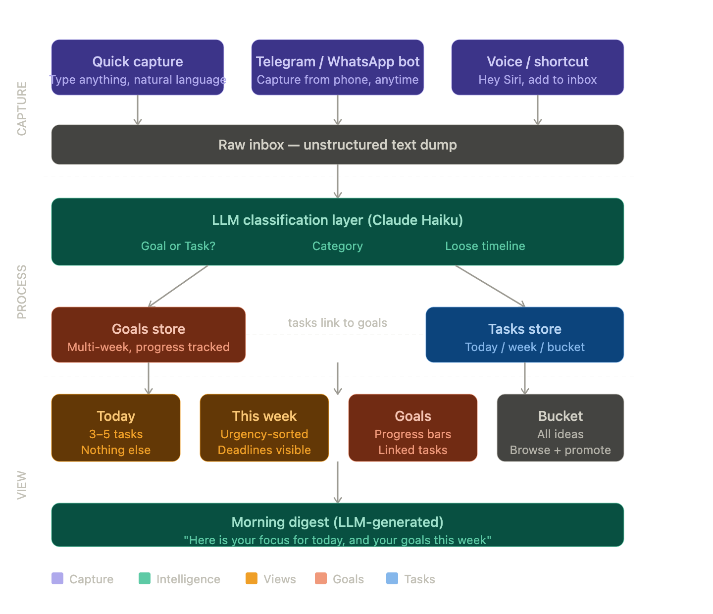

## Input Prompt

I want to come up with a system that will help me track, plan and schedule my days, my weeks and life altogether. Over time what i have learnt about myself is that I love to make a plan, but i dont always end up following the plan, and two of the reasons is that, one: the plan is too ambitious and you dont have all good days in a row to achieve the ambitious plan. Two: You cant always see the plan you've made. So with time I forget what was the plan and life goes on as usual.

About part one - i have with time figured out what sorts of plans to make that are more acheivable and i have seen better results. It is part two that i struggle with and want your help. 
I want to build a system which makes it easy to capture ideas, thoughts, priorities, tasks, wishes, etc as and when i have them throughout the day. i also want to structure them in a way that i can prioritize which ones i want to focus on during the day, in a week, in the month, etc. Usually, I have clarity at best upto a week. Beyond that is just a bucket of things. So for longer durations, larger motivating goals make make more sense. Another important factor is that the plan that I visualize cannot be cluttered that i cannot immediately tell what is my goal, priority. It needs to be a clean, easy to focus plan, with the option for me to dump every idea i ever had and also have them to auto-categorised into categories like chore, wish, upgrade, etc. along with maybe timelines associated to them. Loose timelines, deadlines like half a week for example need to be associated with the ones that are scheduled.

Sometimes certain ideas are just larger goals and ambitions ex: building self confidence. i would like to be able to capture this as a goal. but the actionables for this will be many folds and will happen over weeks or months. so i need to be able to track such larger goals as well, and the progress i make towards larger goals through the smaller tasks i schedule for it.

I have built complicated systems in the past, but they dont work because either the system doesnt let me visualize things at any point of my week to see where i am in an easy manner, or the visualization is great, but it takes so long to capture all the parameters for each goal i think of. There are larger and smaller goals all, and there needs to be a system that can auto classify, suggest and method, and it all be easy to comprehend.

Tell me how such a system can be built. Focus on:

1. keeping the idea capturing process easy and can be done at any time. 

2. The system itself can handle larger goals and smaller tasks differently without needing too many inputs from me.

3. I am able to visualize my plans anytime so it helps me keep track and plan days ahead, and track progress.

I am an AI engineer. Feel free to use small LLMs or free LLMs in your solution as I can set it all up and also pay a small fee for LLM calls if need be. I need a system that solves these issues.

## Claude Response:

This is a really well-articulated problem — and the key insight you've identified is right: **capture friction** and **visibility** are the two killers of planning systems. Let me design a concrete system for you.

Here's the architecture of what I'd build:Here's how each layer works and why it solves your specific problems:

---

Here's how each layer works and why it solves your specific problems:

**Capture Layer — zero friction, three entry points**

The core rule is: one text field, natural language, no required fields. You type "call the dentist sometime this week" and hit enter. That's it. No dropdowns, no priority sliders, no category picking. The system handles all that. The three capture channels are a web/PWA quick-capture box (always open in a tab or on your phone home screen), a Telegram or WhatsApp bot (so you can just message it like a person, even while walking), and optionally a Siri/Google shortcut that pipes your voice note straight into the inbox.

**Intelligence Layer — LLM does the heavy lifting**

Every raw capture gets processed by Claude Haiku (cheap, fast, ~$0.0002 per call). The LLM does three things: decides if it's a **Goal** (multi-week, not immediately actionable — e.g. "build self confidence") or a **Task** (concrete, completable — e.g. "call dentist"), assigns a **category** (chore, wish, upgrade, health, work, etc.), and assigns a **loose timeline** (today, this week, this month, bucket). You never do this manually. For Goals, the LLM also proactively suggests 2–3 starter tasks you can accept or dismiss with one tap.

**Data Model — Goals and Tasks treated differently**

A Goal has a title, description, category, and a `progress %` that auto-updates as linked tasks complete. A Task has a title, category, urgency bucket (today / this week / bucket), an optional loose deadline ("by end of week"), and an optional `linked_goal`. This link is what lets you see "I'm 40% through building self confidence" based on the 4 of 10 tasks you've checked off over the last month.

**View Layer — clean by design, not by discipline**

Four views, each with a strict job. The **Today view** shows only 3–5 tasks. The system enforces this — it helps you pick from this-week tasks, not dump everything at once. The **Week view** shows all tasks sorted by urgency with deadlines visible. The **Goals view** shows each goal as a card with a progress bar and the next 2–3 recommended tasks. The **Bucket** is your idea dump — everything unscheduled, browsable by category, and you can promote anything to "this week" with one tap. The morning digest is a short LLM-generated paragraph: "You have 2 tasks due this week. Your top goal this month is X — the next step is Y."

---

**Tech stack to build this**

The backend is FastAPI + SQLite (or Supabase if you want sync across devices). The frontend is a React PWA — mobile-first, installable. The LLM classification is a single Haiku call per capture. The morning digest is one Sonnet call per day. The Telegram bot is about 50 lines of Python using `python-telegram-bot`. Total LLM cost: probably under ₹50/month for normal usage.

The build order I'd suggest: start with the capture + Haiku classifier + SQLite backend first. Get the inbox working. Then add the four views. Then add the Telegram bot. The whole MVP is probably 2–3 weekends of work for you.